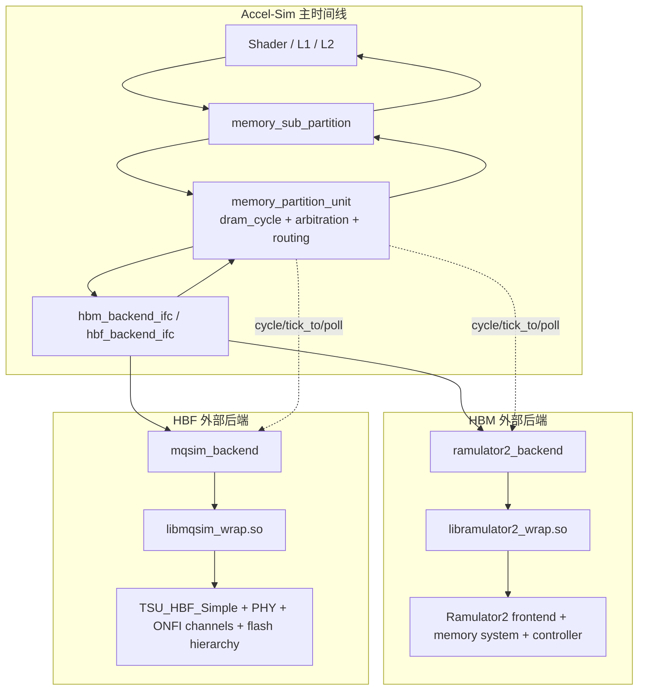

# Accel-Sim + MQSim + Ramulator2 联合仿真开发文档

## 1. 先看整体分层

联合仿真的核心原则只有一句话：

**Accel-Sim 继续做主仿真器和主时间线，Ramulator2/MQSim 只做“外部内存时序后端”。**

也就是说，SM、warp、L1/L2、ICNT、memory partition/sub-partition 这些仍然由 Accel-Sim 控制；只有当请求真正离开 `memory_partition_unit` 进入 HBM/HBF 时，才交给外部模拟器。

图里有两个重点：

- **数据流**：`mem_fetch*` 从 Accel-Sim 发出，绕一圈后还是回到 Accel-Sim
- **控制流**：真正推进外部模拟器时间的是 `memory_partition_unit::dram_cycle()`

---

## 2. 代码入口在哪里

如果你第一次读代码，按下面这个顺序最省时间：

1. `gpu-simulator/gpgpu-sim/src/gpgpu-sim/mem_backend.h`
2. `gpu-simulator/gpgpu-sim/src/gpgpu-sim/l2cache.cc:78`
3. `gpu-simulator/gpgpu-sim/src/gpgpu-sim/l2cache.cc:367`
4. `gpu-simulator/gpgpu-sim/src/gpgpu-sim/ramulator2_backend.cc`
5. `gpu-simulator/gpgpu-sim/src/gpgpu-sim/mqsim_backend.cc`
6. `external_wrappers/ramulator2_wrap/ramulator2_wrap.cpp`
7. `external_wrappers/mqsim_wrap/mqsim_wrap.cpp`

其中最关键的文件分工如下：

| 文件 | 作用 |
| --- | --- |
| `mem_backend.h` | 定义外部内存后端的统一接口 |
| `l2cache.cc` | 在 partition 层实例化后端、做路由、发请求、收回包 |
| `gpu-sim.h` / `gpu-sim.cc` | 注册配置项，决定 HBM/HBF 请求 tagging 策略 |
| `ramulator2_backend.cc` | HBM 适配层，负责 `dlopen + dlsym + shared state` |
| `mqsim_backend.cc` | HBF 适配层，负责 MQSim 参数覆盖和回包管理 |
| `ramulator2_wrap.cpp` | 把 Ramulator2 暴露成稳定的 C ABI |
| `mqsim_wrap.cpp` | 把 MQSim 暴露成稳定的 C ABI，并构建最小 HBF flash 路径 |

---

## 3. 统一接口层为什么重要

本项目不是直接在 `memory_partition_unit` 里写死 Ramulator2/MQSim，而是先定义了两个最小接口：

- `hbm_backend_ifc`，见 `gpu-simulator/gpgpu-sim/src/gpgpu-sim/mem_backend.h`
- `hbf_backend_ifc`，见 `gpu-simulator/gpgpu-sim/src/gpgpu-sim/mem_backend.h`

这两个接口只保留了原 `dram_t / hbf_t` 在 partition 侧真正需要的操作：

- `full(bool is_write)`
- `push(mem_fetch*)`
- `cycle()`
- `return_queue_top()`
- `return_queue_pop()`
- 若干打印/功耗统计接口

这样做的直接收益是：

1. `memory_partition_unit` 上游逻辑基本不用改
2. 内置 `dram_t / hbf_t` 和外置 `Ramulator2 / MQSim` 可以平滑切换
3. 后续如果再接别的后端，仍然走同一套 contract

创建后端的切换点就在 `gpu-simulator/gpgpu-sim/src/gpgpu-sim/l2cache.cc:78` 的 `memory_partition_unit::memory_partition_unit()`：

- `-hbm_use_ramulator2=1` 时创建 `ramulator2_backend`
- 否则创建原生 `dram_t`
- `-hbf_use_mqsim=1` 时创建 `mqsim_backend`
- 否则创建原生 `hbf_t`

这一步把“是否启用外部联合仿真”压缩成了构造阶段的一次替换。

---

## 4. 端到端请求生命周期

这一节是整套联合仿真的主线。假设一个 warp 产生了一次会 miss 到片外内存的访问。

### 4.1 `mem_fetch` 在哪里带上 partition 信息

`mem_fetch` 在创建时就保存了两套地址信息：

- 全局物理地址：`get_addr()`
- partition 内局部地址：`get_partition_addr()`

对应代码：

- `gpu-simulator/gpgpu-sim/src/gpgpu-sim/mem_fetch.cc:62`
- `gpu-simulator/gpgpu-sim/src/gpgpu-sim/addrdec.cc:78`

这里的 `partition_addr` 很关键。它不是原始地址，而是把 channel/subpartition 交织相关位折掉之后，得到“该 partition 内部看到的线性地址”。  
当前 HBF 的 MQSim 路径就是拿这个地址继续往下映射。

### 4.2 请求进入 sub-partition

`memory_sub_partition::push()` 在 `gpu-simulator/gpgpu-sim/src/gpgpu-sim/l2cache.cc:936`。

它做的事情不是直接进 DRAM/HBF，而是先：

- 根据 L2 模式决定是否拆成 sector request
- 经过 ROP delay
- 放入后续 partition 可见的队列

所以从整体上看，**联合仿真挂接点是在 partition 层，不是在 shader core 或 L2 cache 里直接接外部后端**。

### 4.3 partition 层才真正做 HBM/HBF 路由

核心函数是 `memory_partition_unit::dram_cycle()`，在 [l2cache.cc](../gpu-simulator/gpgpu-sim/src/gpgpu-sim/l2cache.cc#L367)。

这个函数每个 DRAM tick 都会做四类事情：

1. 从 HBM return queue 收完成请求，塞回目标 sub-partition 的 `dram_L2_queue`
2. 从 HBF return queue 收完成请求，塞回目标 sub-partition 的 `dram_L2_queue`
3. 调用 HBM/HBF backend 的 `cycle()` 推进外部时间线
4. 在多个 sub-partition 间仲裁一个新请求，对它做 HBM/HBF tagging，并发往相应后端

这就是当前系统最重要的控制循环。

### 4.4 HBM/HBF tagging 在哪决定

路由策略来自 `memory_config::is_hbf_request()`，定义在 [gpu-sim.h](../gpu-simulator/gpgpu-sim/src/gpgpu-sim/gpu-sim.h#L447)。

当前支持三种策略：

- 固定 partition 范围走 HBF
- 指定地址区间走 HBF
- 伪随机比例走 HBF

同时，`hbf_request_trace_open()` / `hbf_request_trace_log()` 会把 routing 决策打进 trace 文件，见：

- [gpu-sim.cc](../gpu-simulator/gpgpu-sim/src/gpgpu-sim/gpu-sim.cc#L447)
- [gpu-sim.cc](../gpu-simulator/gpgpu-sim/src/gpgpu-sim/gpu-sim.cc#L466)

### 4.5 partition 发请求不是“立刻 push 到外部后端”

在 `dram_cycle()` 里，请求先经过一个固定延迟队列：

- HBM 走 `m_dram_latency_queue`
- HBF 走 `m_hbf_latency_queue`

只有 ready 之后才真正调用 backend 的 `push()`。

这一步保留了 Accel-Sim 原来 partition 到 memory controller 之间的固定延迟语义，避免“外部后端一接上就把原本 pipeline latency 抹掉”。

---

## 5. Accel-Sim 怎样和外部后端同步时间

这是联合仿真里最容易搞错的地方。

### 5.1 主时间线永远在 Accel-Sim

当前实现里，Ramulator2 和 MQSim 都不是自由运行的。  
它们只会在 `memory_partition_unit::dram_cycle()` 调用 backend `cycle()` 时被推进。

也就是说：

- **谁决定现在模拟到了哪个时刻？** `Accel-Sim`
- **外部后端怎样知道自己该跑到哪里？** backend 把 Accel-Sim 当前 DRAM 时间转换成 `time_ns`，再调用 wrapper 的 `tick_to(time_ns)`

### 5.2 时间换算怎么做

`ramulator2_backend::now_time_ns()` 和 `mqsim_backend::now_time_ns()` 都用了同一逻辑：

- 取 `gpgpu_sim` 的 `get_dram_time()`
- 减去一个 `get_dram_period()`
- 转成 ns

对应代码：

- [ramulator2_backend.cc](../gpu-simulator/gpgpu-sim/src/gpgpu-sim/ramulator2_backend.cc#L148)
- [mqsim_backend.cc](../gpu-simulator/gpgpu-sim/src/gpgpu-sim/mqsim_backend.cc#L233)

减去一个周期的原因是：`gpgpu_sim` 内部保存的是“下一个 DRAM edge”的时间，而后端此时应该被推进到“当前刚发生的 edge”。

### 5.3 为什么只有 partition 0 驱动外部时间

两个 backend 都采用 **shared instance** 模式：

- 一个 Ramulator2 实例给所有 HBM partition 共用
- 一个 MQSim 实例给所有 HBF partition 共用

所以每个 DRAM tick 只能有一个 partition 负责：

- `tick_to(time_ns)`
- `poll()` 所有 completions

当前代码里就是 `if (m_id != 0) return;`：

- [ramulator2_backend.cc](../gpu-simulator/gpgpu-sim/src/gpgpu-sim/ramulator2_backend.cc#L202)
- [mqsim_backend.cc](../gpu-simulator/gpgpu-sim/src/gpgpu-sim/mqsim_backend.cc#L284)

这是一个非常务实的实现选择：简单、稳定、避免重复推进同一个外部实例。

---

## 6. HBM 路径：Ramulator2 是怎么接进来的

### 6.1 Accel-Sim 侧 `ramulator2_backend`

HBM 适配层在 [ramulator2_backend.cc](../gpu-simulator/gpgpu-sim/src/gpgpu-sim/ramulator2_backend.cc)。

构造函数 `ramulator2_backend::ramulator2_backend()`，见第 83 行附近，负责：

1. 检查 `-hbm_use_ramulator2`
2. 初始化 shared state
3. `dlopen()` wrapper 动态库
4. `dlsym()` 绑定 `ram2_create / ram2_destroy / ram2_send / ram2_tick_to / ram2_poll`
5. 创建唯一的 shared Ramulator2 handle

这里 deliberately 用的是 `dlopen + C ABI`，而不是把 Ramulator2 直接静态/动态链接进 Accel-Sim。原因很直接：

- Ramulator2 的构建体系、依赖和 C++ ABI 与 Accel-Sim 不同
- wrapper 可以把异常、模板、YAML、第三方依赖都封在外面
- Accel-Sim 只面对一组稳定的 C 函数签名

### 6.2 `push()` 做了什么

`ramulator2_backend::push()`，见 [ramulator2_backend.cc](../gpu-simulator/gpgpu-sim/src/gpgpu-sim/ramulator2_backend.cc#L164)。

它做的事情很少，但有两个关键点：

1. 发送的是 `mf->get_addr()`，也就是全局地址
2. `source_id` 被强制压成 `0`

第二点是一个有意的兼容性处理。注释里已经写得很清楚：Ramulator2 frontend 的 per-core 向量大小和 Accel-Sim 的 `sid` 不匹配，直接传 SM id 容易越界，所以目前只保留单 source 统计。

### 6.3 `cycle()` 做了什么

`ramulator2_backend::cycle()`，见 [ramulator2_backend.cc](../gpu-simulator/gpgpu-sim/src/gpgpu-sim/ramulator2_backend.cc#L202)。

逻辑非常直：

1. 只有 partition 0 真正执行
2. 计算当前 `t_ns`
3. 调 `ram2_tick_to(t_ns)`
4. 反复 `ram2_poll()` 取 completion
5. completion 里的 `user_ptr` 重新解释成 `mem_fetch*`
6. 根据 `mf->get_tlx_addr().chip` 把请求放回正确 partition 的 return queue

如果是 `L1_WRBK_ACC / L2_WRBK_ACC`，则不回到 L2，而是直接标记完成并删除，保持与原生 `dram_t` 一致。

### 6.4 Ramulator2 wrapper 做了哪些语义转换

wrapper 文件在 [ramulator2_wrap.cpp](../external_wrappers/ramulator2_wrap/ramulator2_wrap.cpp)。

最关键的四个导出函数：

- `ram2_create()`，第 55 行
- `ram2_send()`，第 101 行
- `ram2_tick_to()`，第 119 行
- `ram2_poll()`，第 172 行

它们各自承担的角色是：

- `ram2_create()`：解析 YAML，创建 frontend 和 memory system
- `ram2_send()`：只把请求先塞进 wrapper 自己的 `pending` 队列
- `ram2_tick_to()`：把 ns 目标时间离散化成 Ramulator2 ticks，并一边注入请求一边 `mem->tick()`
- `ram2_poll()`：把 wrapper 暂存的 completion 吐给 Accel-Sim

### 6.5 为什么 HBM 也要做 posted write ACK

这是当前实现里最重要的一个设计点。

原因不是“偷懒”，而是 **Ramulator2 的当前控制器完成回调天然只覆盖 read，不覆盖 write**。  
所以如果 GPU store 一定要等“真实 write 完成”再 ACK，Accel-Sim 这一侧就可能永远等不到 completion。

当前做法是：

- read：用 Ramulator2 回调的真实 `depart` 时间回包
- write：请求一旦被 frontend/memory system 接收，就在 wrapper 中给一个 posted ACK

对应代码见 [ramulator2_wrap.cpp](../external_wrappers/ramulator2_wrap/ramulator2_wrap.cpp#L119) 一段里的 read/write 分支。

---

## 7. HBF 路径：MQSim 是怎么改造成 HBF 后端的

### 7.1 这条路径不走 SSD host stack

这是理解当前实现的第一前提。

当前 MQSim 路径不是“GPU -> NVMe -> SSD controller -> flash”。  
它直接保留 **flash 内部层级与时序**，跳过 SSD host interface / FTL / cache / GC 那一大层，把 GPU 请求直接变成 flash transaction。

所以它更像：

`Accel-Sim -> mqsim_backend -> mqsim_wrap -> TSU / PHY / Channel / Flash_Chip`

而不是传统 SSD 仿真路径。

### 7.2 Accel-Sim 侧 `mqsim_backend`

HBF 适配层在 [mqsim_backend.cc](../gpu-simulator/gpgpu-sim/src/gpgpu-sim/mqsim_backend.cc)。

构造函数 `mqsim_backend::mqsim_backend()`，见第 103 行附近，负责：

1. 检查 `-hbf_use_mqsim`
2. `dlopen()` MQSim wrapper
3. 优先找 `mq_create2()`，因为这个版本支持用 Accel-Sim 的 `-hbf_*` 参数覆盖 XML
4. 如果 `mq_create2()` 存在，就把 `hbf_page_bytes / hbf_subpage_bytes / hbf_dies_per_channel / hbf_planes_per_die / hbf_t_read / hbf_t_prog / hbf_t_erase / hbf_channel_bytes_per_cycle` 等参数重新编码进 `mq_create_params_t`

这一步非常关键，因为它把**用户在 Accel-Sim config 里改的 HBF 参数**真正传递到了 MQSim 侧，而不是只读 MQSim XML。

### 7.3 `push()` 为什么发的是 `partition_addr`

`mqsim_backend::push()` 在 [mqsim_backend.cc](../gpu-simulator/gpgpu-sim/src/gpgpu-sim/mqsim_backend.cc#L249)。

和 HBM 不同，它发送的是：

- `part_id = m_id`
- `part_addr = mf->get_partition_addr()`

原因很简单：

- 当前 HBF 的设计是“每个 partition 看见自己的局部地址空间”
- MQSim wrapper 里再根据 `part_id + part_addr` 做 flash 层级映射

所以 MQSim 路径内部不需要重新理解 Accel-Sim 的 channel interleaving，而是直接吃 partition-local address。

### 7.4 MQSim wrapper 的真实核心是什么

wrapper 文件在 [mqsim_wrap.cpp](../external_wrappers/mqsim_wrap/mqsim_wrap.cpp)。

建议直接按这个顺序读：

1. `TSU_HBF_Simple`，第 66 行
2. `map_to_ppa()`，第 233 行
3. `tx_serviced_cb()`，第 269 行
4. `mq_create()` / `mq_create2()`，第 470 / 490 行
5. `mq_send()`，第 537 行
6. `mq_tick_to()`，第 547 行
7. `mq_poll()`，第 615 行

### 7.5 `TSU_HBF_Simple` 做了什么

`TSU_HBF_Simple` 是当前 HBF 路径的最小调度器。

它不是 MQSim 原本 SSD 完整调度/FTL 流程，而是一个非常直接的 flash transaction scheduler：

- 为每个 `(channel, chip)` 建一个 read queue 和 write queue
- 有请求进来时放入这些队列
- channel 空闲且 chip 空闲时就尽快发给 PHY

也就是说，现在保留的是：

- channel/chip/die/plane 资源冲突
- PHY/ONFI/NVDDR2 传输延迟
- flash 读写执行时间

而没有保留：

- NVMe/SATA host interface
- FTL
- page mapping cache
- GC / wear leveling

这正是“把 MQSim 当 HBF 内部 flash 细节后端用，而不是当 SSD 整机用”的实现方式。

### 7.6 `map_to_ppa()` 怎样把地址映射到 flash 层级

`map_to_ppa()` 在 [mqsim_wrap.cpp](../external_wrappers/mqsim_wrap/mqsim_wrap.cpp#L233)。

它把 `part_addr` 依次拆到：

- `ChannelID`
- `ChipID`
- `DieID`
- `PlaneID`
- `BlockID`
- `PageID`

注意这里的 `ChannelID` 是 **flash 总线 channel**，不是“chip 里面又有一个 channel”。  
MQSim 的层级关系是：

`Channel -> Chip -> Die -> Plane -> Block -> Page`

其中：

- `ONFI_Channel_Base` 代表控制器/PHY 到一组 flash chips 的总线，见 `MQSim/src/ssd/ONFI_Channel_Base.h`
- `Flash_Chip::ChannelID` 只是记录“这个 chip 挂在哪个 channel 上”，见 `MQSim/src/nvm_chip/flash_memory/Flash_Chip.h`
- `Physical_Page_Address::ChannelID` 同样只是地址字段，见 `MQSim/src/nvm_chip/flash_memory/Physical_Page_Address.h`

### 7.7 `mq_tick_to()` 的执行顺序

`mq_tick_to()` 在 [mqsim_wrap.cpp](../external_wrappers/mqsim_wrap/mqsim_wrap.cpp#L547)。

顺序是：

1. 先把 MQSim engine 跑到目标时间，退休已有 flash 事件
2. 再把 wrapper 里积攒的 pending 请求作为“当前时刻到达”的 transaction 注入
3. 调 `TSU_HBF_Simple::Schedule()`
4. 再 `Run_until(time_ns)` 一次，处理当前时刻新产生的立即事件

这说明 wrapper 不是逐 request 即时驱动 MQSim，而是把 Accel-Sim 的一个 DRAM tick 当作外部同步边界，在这个边界上批量推进。

### 7.8 MQSim 路径的 completion 语义

`tx_serviced_cb()` 在 [mqsim_wrap.cpp](../external_wrappers/mqsim_wrap/mqsim_wrap.cpp#L269)。

它故意只把 **READ** 变成 completion：

- read：等 flash 真正 serviced 后回包
- write：采用 posted write，`mq_tick_to()` 接收请求后立即给 GPU ACK

对应 write ACK 的实现见 `mq_tick_to()` 里 write 分支，位于第 591 行附近。

这样做的原因和 HBM 路径类似：  
GPU 这边需要“请求被内存系统接收”的确认，而不一定要等 flash program 真正执行完才释放前端流水；真正的 program latency 仍然会通过 die/plane busy 影响后续请求。

---

## 8. 共享实例、分区并行和回包路由

这套实现里，“shared backend instance + per-partition bookkeeping” 是第二个最重要的设计点。

两个 backend 的 shared state 都保存了：

- `returnq[partition]`
- `mp_by_part[partition]`
- `outstanding[partition]`
- 每个 partition 的计数器

也就是说：

- **外部模拟器实例是共享的**
- **但 Accel-Sim 看出去仍然像每个 partition 有自己的后端**

完成请求回来的时候，路由依据是：

- `mf->get_tlx_addr().chip`

这个字段就是原始目标 memory partition。  
因此 shared backend 内部不需要维护“哪一个 backend 对象发出的请求”，只要 completion 能带回 `mem_fetch*`，再从 `mem_fetch` 里反查 partition 即可。

---

## 9. 为什么必须用 wrapper，而不是直接链接第三方库

这是工程设计问题，不是代码风格问题。

当前 wrapper 层承担了四件 Accel-Sim 本体不该承担的事：

1. **ABI 隔离**  
   Ramulator2/MQSim 都是大 C++ 工程，直接链接会把编译器、依赖、异常、模板和符号污染都带进来。

2. **时间语义转换**  
   Accel-Sim 讲的是 `DRAM tick`，wrapper 要把它翻译成 `ns` 或 memory ticks。

3. **请求语义转换**  
   Accel-Sim 发的是 `mem_fetch*`；Ramulator2 要的是 read/write request；MQSim 要的是 flash transaction + PPA。

4. **completion 语义补全**  
   尤其是 posted write ACK，这一层最适合做，因为它知道“外部模拟器天然提供了什么 completion，GPU 侧又需要什么 completion”。

简化理解就是：

**backend 文件解决的是“Accel-Sim 怎么调用”**  
**wrapper 文件解决的是“第三方模拟器怎么被调用”**

---

## 10. 当前实现的关键取舍

下面这些都不是 bug，而是当前设计的明确边界。

### 10.1 HBM 是“真实 DRAM 后端”，但 source 统计被折叠

Ramulator2 路径保留了它自己的 controller 和 timing 行为，但目前 `source_id` 强制为 `0`，不做 per-SM 统计。

### 10.2 HBF 是“保留 flash 内部结构的最小可用路径”

MQSim 路径保留了：

- flash 层级结构
- PHY / channel 传输
- die/plane 资源冲突
- read/program/erase latency

但没有保留完整 SSD host 栈、FTL 和 GC。

### 10.3 partition 之间没有直接通信

无论 HBM 还是 HBF，partition 之间不会直接互相传数据。  
它们共享的只是：

- 同一个外部 backend 实例
- Accel-Sim 的上层回包队列和仲裁逻辑

### 10.4 HBM/HBF completion 仍然会在 Accel-Sim 上层汇合

HBF/HBM 的完成请求最终都要回到 `memory_sub_partition::dram_L2_queue`。  
所以当这个队列被堵住时，mixed 模式下两个后端之间仍然可能出现 HOL blocking。

---

## 11. 配置面是怎样连到实现里的

几个最重要的开关在：

- `gpu-simulator/gpgpu-sim/src/gpgpu-sim/gpu-sim.cc:413`
- `gpu-simulator/gpgpu-sim/src/gpgpu-sim/gpu-sim.cc:431`

HBM 路径相关：

- `-hbm_use_ramulator2`
- `-hbm_ramulator2_wrapper`
- `-hbm_ramulator2_config`
- `-hbm_ramulator2_max_outstanding`

HBF 路径相关：

- `-hbf_use_mqsim`
- `-hbf_mqsim_wrapper`
- `-hbf_mqsim_config`
- `-hbf_mqsim_max_outstanding`

HBF 模型参数相关：

- `-hbf_page_bytes`
- `-hbf_subpage_bytes`
- `-hbf_block_pages`
- `-hbf_dies_per_channel`
- `-hbf_planes_per_die`
- `-hbf_t_read`
- `-hbf_t_prog`
- `-hbf_t_erase`
- `-hbf_channel_bytes_per_cycle`

当前 MQSim 路径里，这些参数会在 `mqsim_backend::mqsim_backend()` 中被重新打包为 `mq_create_params_t`，然后通过 `mq_create2()` 覆盖 MQSim XML 默认值。

---

## 12. 如果你要继续开发，建议从哪里下手

### 12.1 想改路由策略

先看：

- [gpu-sim.h](../gpu-simulator/gpgpu-sim/src/gpgpu-sim/gpu-sim.h#L447)
- [l2cache.cc](../gpu-simulator/gpgpu-sim/src/gpgpu-sim/l2cache.cc#L367)

### 12.2 想改 HBM 完成语义或接别的 DRAM 模型

先看：

- [ramulator2_backend.cc](../gpu-simulator/gpgpu-sim/src/gpgpu-sim/ramulator2_backend.cc)
- [ramulator2_wrap.cpp](../external_wrappers/ramulator2_wrap/ramulator2_wrap.cpp)

### 12.3 想扩展 HBF 内部并行或写语义

先看：

- [mqsim_backend.cc](../gpu-simulator/gpgpu-sim/src/gpgpu-sim/mqsim_backend.cc)
- [mqsim_wrap.cpp](../external_wrappers/mqsim_wrap/mqsim_wrap.cpp)
- `TSU_HBF_Simple`
- `map_to_ppa()`

### 12.4 想把“partition 0 驱动 shared backend”改成全局 driver

先看：

- `ramulator2_backend::cycle()`
- `mqsim_backend::cycle()`
- `gpgpu_sim::cycle()` 的 DRAM 时钟域调度

这会是一次结构性重构，但思路是清楚的：把 shared backend 的推进从单个 partition 对象中抽出去，变成一个真正的 global memory backend driver。

---

## 13. 对外介绍时可以怎么概括

如果你要在 GitHub README 或汇报里用一句话概括这个项目，可以直接这样说：

> 这个项目把 Accel-Sim 保留为 GPU 主仿真器，通过统一的 memory backend 接口把片外内存请求转发给 Ramulator2 和 MQSim；HBM 走真实 DRAM 控制器时序，HBF 走保留 flash 内部层级和链路时序的最小 MQSim 路径，三者通过 wrapper 在同一个主时间线上同步。

如果再展开一点，可以补三句：

- Accel-Sim 负责计算侧、cache、ICNT 和 memory partition 仲裁
- Ramulator2/MQSim 负责外部内存时序细节
- wrapper 负责 ABI 隔离、时间同步、请求转换和 completion 语义补全

---

## 14. 结论

这套联合仿真的本质不是把三个模拟器“硬拼”在一起，而是把它们放到非常明确的职责边界上：

- `Accel-Sim` 管主时间线和 GPU 行为
- `Ramulator2` 管 HBM 时序
- `MQSim` 管 HBF 的 flash 内部时序
- `external_wrappers/` 管接口翻译和语义粘合

因此，后续无论你要做：

- 更复杂的 HBF/HBM 混合策略
- 更真实的 HBF 写完成语义
- 每 stack / 每 partition 的独立 driver
- 或者替换成别的外部内存模拟器

都应该优先维护这个分层，而不是把逻辑重新写回 `memory_partition_unit` 里。
